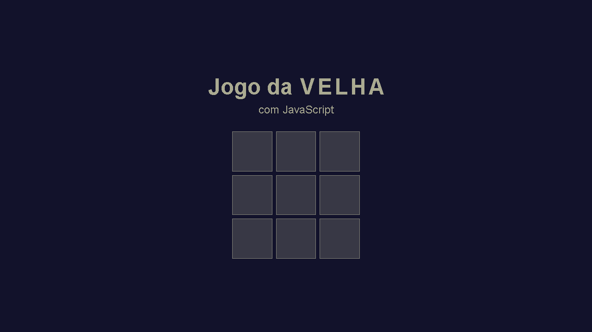

# 🎮 Jogo da Velha

Jogo da Velha desenvolvido em JavaScript, HTML e CSS, rodando em uma página web. Construído com o objetivo de estudar fundamentos da linguagem JavaScript e praticar o uso de tags HTML e estilização com CSS.

---

📌 **Funcionalidades principais:**
- Interface simples e intuitiva para dois jogadores
- Indicação de vitória, empate e reinício de partida
- Jogabilidade totalmente no navegador

---

🎨 **Tecnologias utilizadas:**
- HTML5
- CSS3
- JavaScript

---

🚀 **Objetivo do projeto:**
- Praticar e aprofundar conhecimentos em **JavaScript**
- Exercitar manipulação de DOM e eventos
- Aprender a estruturar jogos simples para web

---

**📌 Tela inicial**

🌐 **Veja a página online:** [https://juliolds.github.io/Jogo-da-Velha/JogoDaVelha.html](https://juliolds.github.io/Jogo-da-Velha/JogoDaVelha.html)
